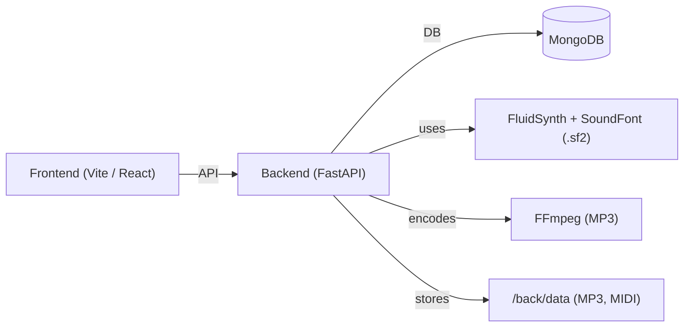
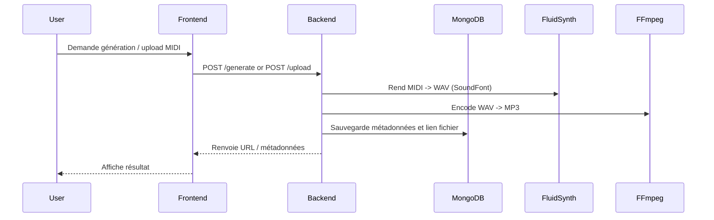

<div align="center">


</div>

Application pour générer et visualiser des musiques piano avec des modèles IA personnalisés.


Objectifs principaux
- Génération de musique piano via un modèle IA personnalisé (MIDI).
- Visualisation des données en temps réel (dashboard/training).
- Interface utilisateur dans le navigateur (React / Vite).
- Enregistrement et interprétation de fichiers MIDI.
- Modèles IA pour générer des fichiers MIDI et proposer titres/auteurs.

Architecture (vue générale)



Flux simplifié (exécution)



Fichiers importants
- `docker-compose.yml` : orchestration (backend, frontend, mongo), montages (SoundFont, `back/data`).
- `back/Dockerfile` : image backend (Python + FluidSynth + FFmpeg + dépendances pip).
- `front/Dockerfile` : build de l'app Vite puis image serveur statique (nginx).
- `back/utils/midi_to_mp3.py` : utilitaire de conversion MIDI→MP3.

Ollama pour la génération d'auteur et titre
Ollama permet de bénéficier de toutes les fonctionnalités de génération d'auteur et de titre de musique. En intégrant Ollama au backend, le projet peut proposer des suggestions intelligentes et contextualisées pour les compositions générées par le modèle IA.

- Télécharger Ollama : https://ollama.ai/
- API par défaut : http://localhost:11434

Comment lancer le projet (option simple via Docker Compose)

```bash
# build et start (recommande)
docker compose build
docker compose up -d

# voir logs
docker compose logs -f backend
```

Accès
- Backend : http://localhost:8000
- Frontend : http://localhost:5173
- Mongo (si exposé) : mongodb://localhost:27017

Lancer localement sans Docker (dev)

1) Backend

```bash
cd back
python -m venv .venv
. .venv/Scripts/activate   # Windows PowerShell
pip install -r ../requirements.txt
# définir .env ou SOUNDFONT_PATH
uvicorn main:app --host 0.0.0.0 --port 8000 --reload
```

Notes backend locales
- Installer `fluidsynth` et `ffmpeg` localement si vous utilisez `midi_to_mp3.py` sans Docker.
- Placer un SoundFont `.sf2` dans `back/utils/` ou définir `SOUNDFONT_PATH`.

2) Frontend (dev)

```bash
cd front
npm install
npm run dev
```

3) Scripts `src/` (outils ML / entraînement)

```bash
cd src
# exemple : lancer un script d'entraînement ou de génération
python train.py
python generate.py
```

Si vous préférez tout lancer sans installer localement, utilisez Docker Compose (voir ci‑dessus).

Conseils et points d'attention
- SoundFont: le projet référence `back/utils/FluidR3_GM.sf2` — soit montez-le via `docker-compose`, soit remplacez la variable d'environnement `SOUNDFONT_PATH`.
- Permissions/volumes: `back/mongo-data` est monté pour persister la base Mongo.
- Sécurité: stocker secrets/URI DB dans `.env` (ne pas committer).

Crédit
- ANGER Matis
- BINET Julien
- BOURGES Carl
- OZDEMIR Sedanur

---
